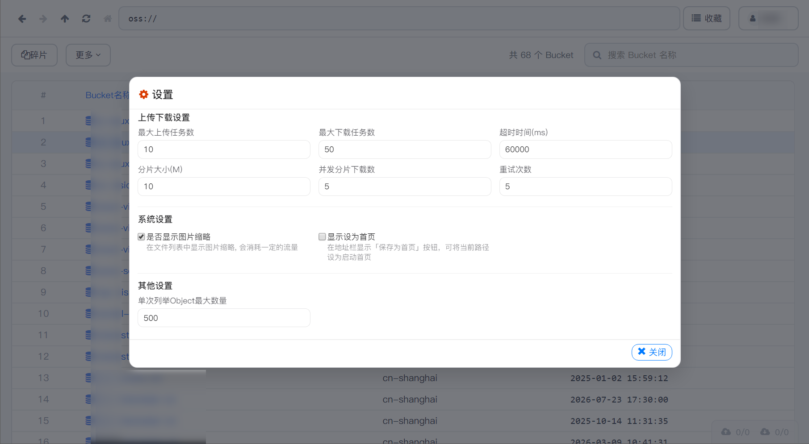
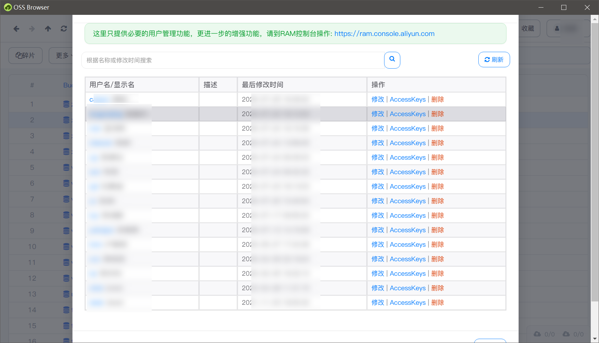

# HYH OSS Browser（定制版）

[](https://github.com/HyhBlazing/hyh-aliyun-oss-browser/releases)
[](LICENSE)
[](https://github.com/HyhBlazing/hyh-aliyun-oss-browser/releases)

基于阿里云开源项目 [aliyun/oss-browser](https://github.com/aliyun/oss-browser) 的 **非官方定制客户端**。  
面向阿里云对象存储（OSS）日常管理：浏览、上传、下载、搜索、授权等，界面改为更简洁的素色风格，并固定为简体中文。


> **重要声明（请先阅读）**  
> - 本项目 **不是** 阿里云 / Alibaba Cloud 官方产品，也与阿里云无隶属或背书关系。  
> - 上游项目采用 **Apache License 2.0**，本仓库在合规前提下进行修改与再分发，详见 [LICENSE](LICENSE)、[NOTICE](NOTICE)。  
> - 「阿里云」「OSS」等名称仅用于说明兼容对象与上游来源，不代表商标授权。  
> - 使用本软件产生的账号安全、数据操作风险由使用者自行承担；请妥善保管 AccessKey。

## 为什么做这个仓库

官方 [oss-browser](https://github.com/aliyun/oss-browser) 功能完整，本仓库侧重：

- 更克制的桌面 UI（素色 / Apple 风格）
- 仅保留简体中文，减少干扰
- 去掉自动升级等不需要的能力
- 提供可直接下载的 Windows / Linux / macOS 安装包

关键词（便于搜索）：`阿里云 OSS` `oss-browser` `Electron` `对象存储客户端` `AccessKey` `Bucket 管理`

## 界面预览

### 设置



### 收藏管理


### 子用户



### 获取访问链接 / 二维码


### 图片预览


### 视频预览


## 快速开始

1. 打开发行页下载对应系统压缩包：  
   **[Releases · v2.0.0](https://github.com/HyhBlazing/hyh-aliyun-oss-browser/releases/tag/v2.0.0)**
2. 解压后运行可执行文件
3. 使用你自己的 AccessKey / 授权码登录（密钥只保存在本机，不会上传到本仓库）

| 平台 | 下载 |
| --- | --- |
| Windows x64 | [oss-browser-win32-x64.zip](https://github.com/HyhBlazing/hyh-aliyun-oss-browser/releases/download/v2.0.0/oss-browser-win32-x64.zip) |
| Windows x32 | [oss-browser-win32-ia32.zip](https://github.com/HyhBlazing/hyh-aliyun-oss-browser/releases/download/v2.0.0/oss-browser-win32-ia32.zip) |
| Linux x64 | [oss-browser-linux-x64.zip](https://github.com/HyhBlazing/hyh-aliyun-oss-browser/releases/download/v2.0.0/oss-browser-linux-x64.zip) |
| macOS x64 | [oss-browser-darwin-x64.zip](https://github.com/HyhBlazing/hyh-aliyun-oss-browser/releases/download/v2.0.0/oss-browser-darwin-x64.zip) |

> macOS 包若在 Windows 交叉打包后无法启动，请在 macOS 本机重新打包。

需要官方原版时，请前往上游仓库或阿里云文档，不要与本定制版混淆。

## 当前版本与技术栈

| 项 | 说明 |
| --- | --- |
| 定制版本 | `2.0.0` |
| 上游基础 | aliyun/oss-browser |
| 桌面框架 | Electron `1.8.4` |
| 前端 | AngularJS `1.5` + Bootstrap 3 |
| 语言 | 仅简体中文 |
| UI | 素色风格（`app/z-mac-theme.css`） |
| 协议 | Apache License 2.0 |

> 当前 Electron 内置 Chromium 较旧，**不支持 flexbox `gap`**，布局间距请使用 `margin`。

## 主要能力

- **登录**：AccessKey、授权码（STS）；子用户可预设 OSS 路径
- **Bucket**：新建 / 删除、ACL、碎片（Multipart）管理
- **文件**：浏览、增删改查、复制 / 移动 / 重命名、拖拽上传、预览
- **传输**：上传 / 下载任务、断点续传
- **地址栏**：`oss://`、前进后退、收藏
- **授权**：简化 RAM Policy、临时授权码
- **其他**：归档解冻、CNAME、请求者付费等

## 相对上游的定制点

- 界面视觉整理（列表、工具栏、传输面板等）
- 仅中文文案（`node/i18n/zh-CN.js`）
- 移除自动升级
- 「保存为首页」默认隐藏，可在设置中开启
- 文件多选以复选框为准；文件名点击用于打开 / 预览

## 开发

### 依赖

- Node.js（`package.json` 标注引擎 `8.2.1`；较新 Node 可用但可能有兼容提示）
- npm / cnpm

### 安装与运行

```bash
cnpm i
# 或 npm i

node node_modules/gulp/bin/gulp.js build --custom=./custom
node node_modules/gulp/bin/gulp.js watch --custom=./custom
# 另开终端
# Windows PowerShell:
$env:NODE_ENV="development"; node_modules/electron/dist/electron.exe .
```

### 打包与发版脚本

```bash
node scripts/package-release.js
node scripts/create-github-release.js
```

更多目录说明、自定义图标与名称见 [custom/Readme.md](custom/Readme.md)。

## 合规与贡献

- 请保留 [LICENSE](LICENSE) 与 [NOTICE](NOTICE)
- 修改文件时建议注明变更意图（Apache 2.0 对再分发的要求）
- 欢迎 Issue / PR；合并到官方请提交至 [aliyun/oss-browser](https://github.com/aliyun/oss-browser)
- 请勿在 Issue、截图、代码中粘贴真实 AccessKey

## 相关链接

- 上游开源：[aliyun/oss-browser](https://github.com/aliyun/oss-browser)
- 官方文档：[OSS Browser 帮助](https://help.aliyun.com/document_detail/61872.html)
- 本仓库发行：[Releases](https://github.com/HyhBlazing/hyh-aliyun-oss-browser/releases)
- 调试说明：[debug.md](debug.md)
- 更新说明：[release-notes/2.0.0.zh-CN.md](release-notes/2.0.0.zh-CN.md)

## License

[Apache License 2.0](LICENSE)

Copyright 2016 Aliyun.com  
Copyright 2026 HyhBlazing（本仓库修改部分）
