# hyh-aliyun-oss-browser

[](https://github.com/HyhBlazing/hyh-aliyun-oss-browser/releases)
[](LICENSE)

基于阿里云开源项目 [aliyun/oss-browser](https://github.com/aliyun/oss-browser) 的 **非官方 3.x 桌面客户端**（Tauri 2 + Vue 3）。

作者：**何昀桦**（[HyhBlazing](https://github.com/HyhBlazing)）

用于浏览、管理阿里云 OSS 及兼容私有云对象存储：上传下载、**拖拽到桌面**、预览、地址/二维码、多 AccessKey、传输队列与系统托盘等。

> **重要声明（请先阅读）**  
> - 本仓库 **不是** 阿里云 / 阿里云 OSS 官方产品，与阿里云无隶属或背书关系。  
> - 上游原作为 [aliyun/oss-browser](https://github.com/aliyun/oss-browser)，版权归原作者 **Aliyun.com**（Apache License 2.0）。  
> - 本仓库为在上游理念与兼容需求上的 **3.x 重写与定制**；修改部分版权见 [NOTICE](NOTICE)。  
> - 「阿里云」「Alibaba Cloud」「OSS」等为相应权利人商标，仅用于说明兼容性与来源。  
> - 请遵守当地法律法规与云服务商协议；请勿提交或泄露真实 AccessKey。  
> - **测试范围：** 当前主要在 **Windows** 上完成功能验证并可正常使用；部分功能未经完整测试。虽提供 macOS / Linux 安装包，但 **其它系统尚未充分测试**，使用请自行评估风险。

## 下载安装

请从 [Releases](https://github.com/HyhBlazing/hyh-aliyun-oss-browser/releases) 获取最新 **3.x** 安装包：

| 平台 | 附件示例 | 说明 |
| --- | --- | --- |
| Windows x64 | `*_x64-setup.exe` / `*_x64_en-US.msi` | 主要测试平台，推荐 |
| macOS Apple Silicon | `*_aarch64.dmg` | **仅 M 芯片（aarch64）**；提供安装包但 **未充分测试** |
| Linux | `*.deb` / `*.rpm` / `*.AppImage` | 提供安装包但 **未充分测试** |

**安装说明：**

- 安装包已内置传输服务（sidecar），**安装后可直接运行，无需再安装 Node.js**。
- Windows 需已安装 [WebView2](https://developer.microsoft.com/microsoft-edge/webview2/)（较新系统一般已自带）。
- macOS 若提示来自未识别开发者，可在「系统设置 → 隐私与安全性」中允许打开。
- 数据目录：`~/.hyh-oss-browser/`（设置、会话、传输状态、窗口位置、sidecar 元信息等）。
- **兼容性提示：** 日常开发与完整功能验证以 Windows 为准；macOS / Linux 构建主要用于打包分发，部分能力（如拖拽到桌面等）可能存在差异或未覆盖测试。

## 界面预览

### 列表浏览

主界面支持 Bucket / 对象列表、地址栏、工具栏操作与底部传输状态。

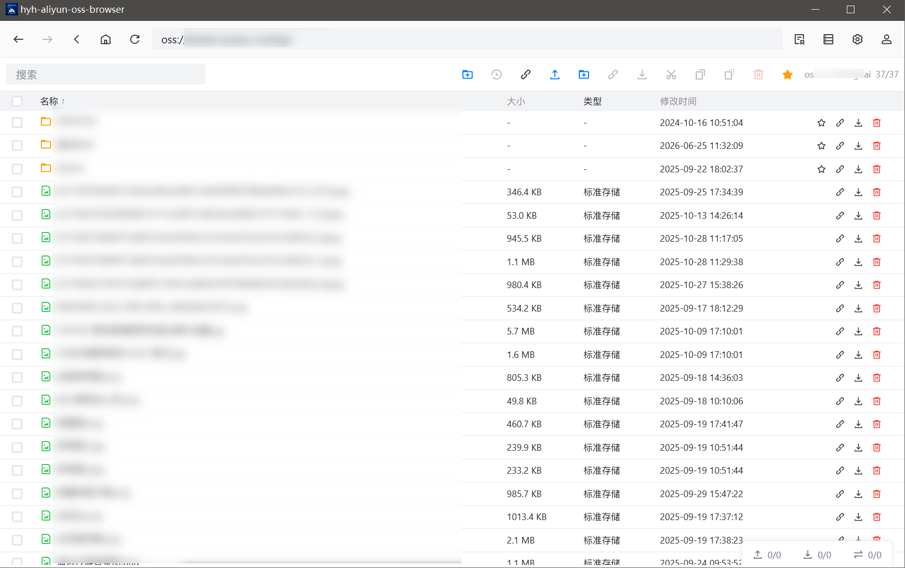

### 功能设置 · 应用

主窗口关闭策略、默认下载目录、图片缩略图等基础选项。

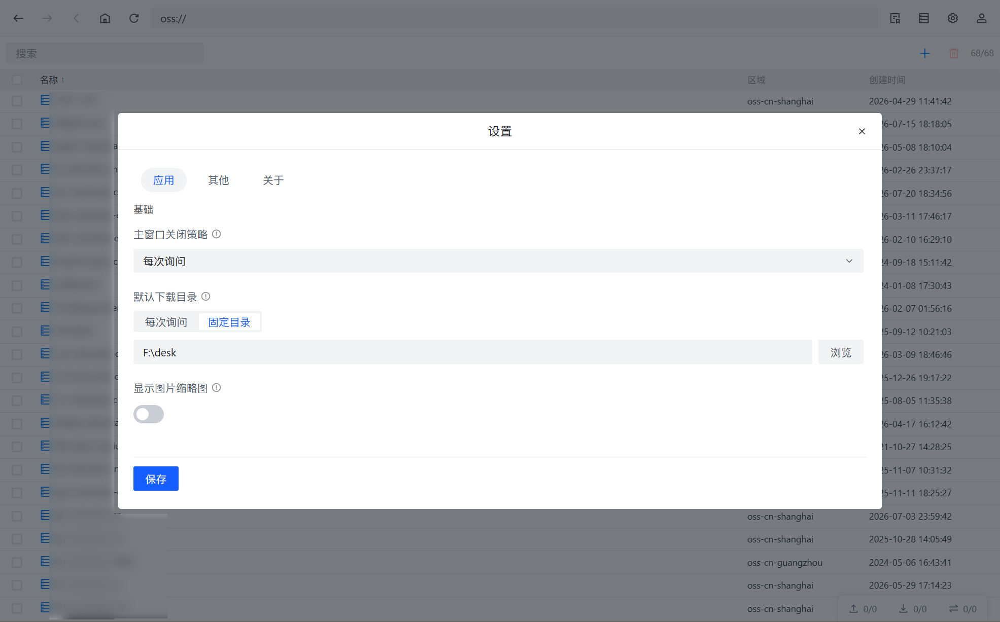

### 功能设置 · 其他

上传/下载并发、分片、重试、列举上限、覆盖同名，以及网络代理与超时。

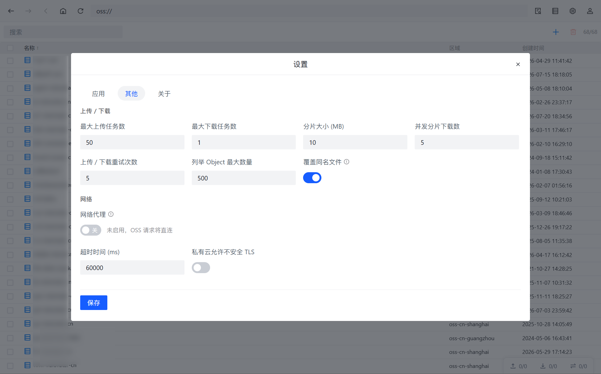

### 功能设置 · 关于

产品信息、本地版本 / 线上版本对比，并可打开 GitHub Releases 检查更新。

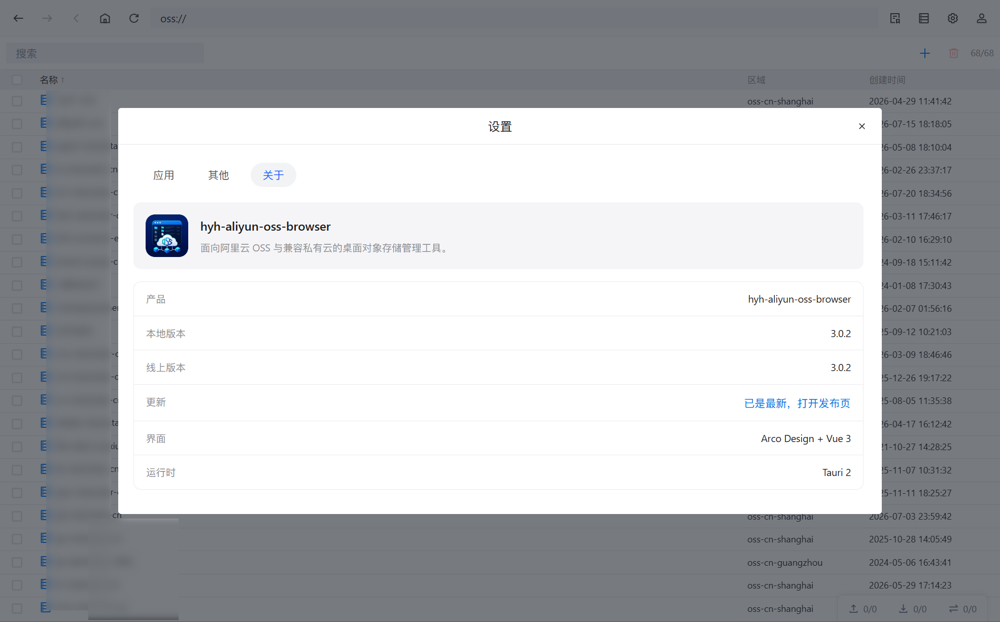

### 多 AccessKey 支持

多组 Key 历史、备注、快速切换账号。

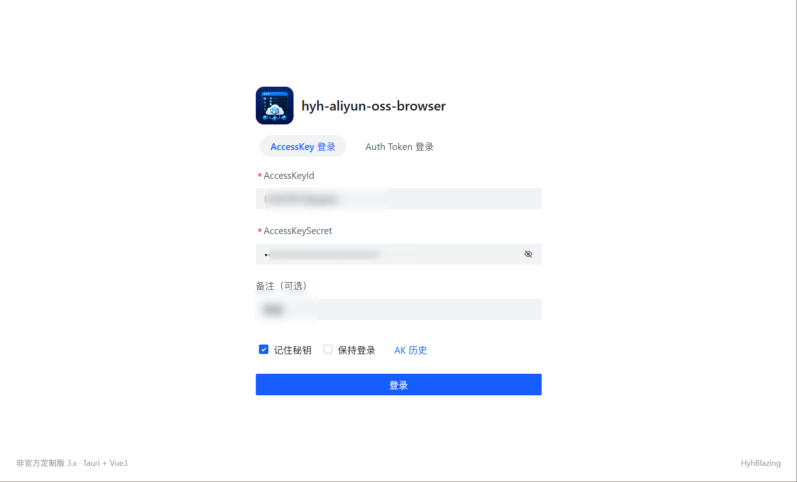

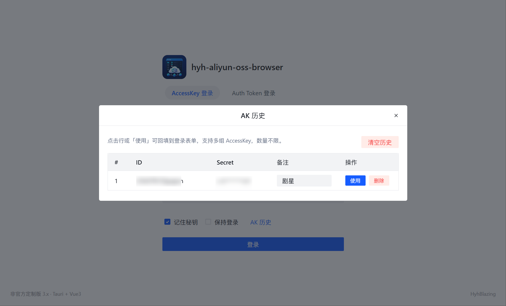

### 收藏管理

按账号隔离的目录收藏，一键跳转。

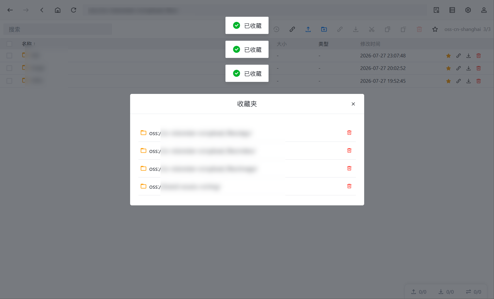

### 获取访问链接 / 二维码

公开直链或私有签名地址，支持域名选择与二维码。

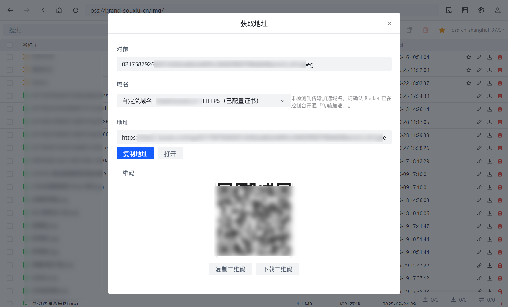

### 图片预览

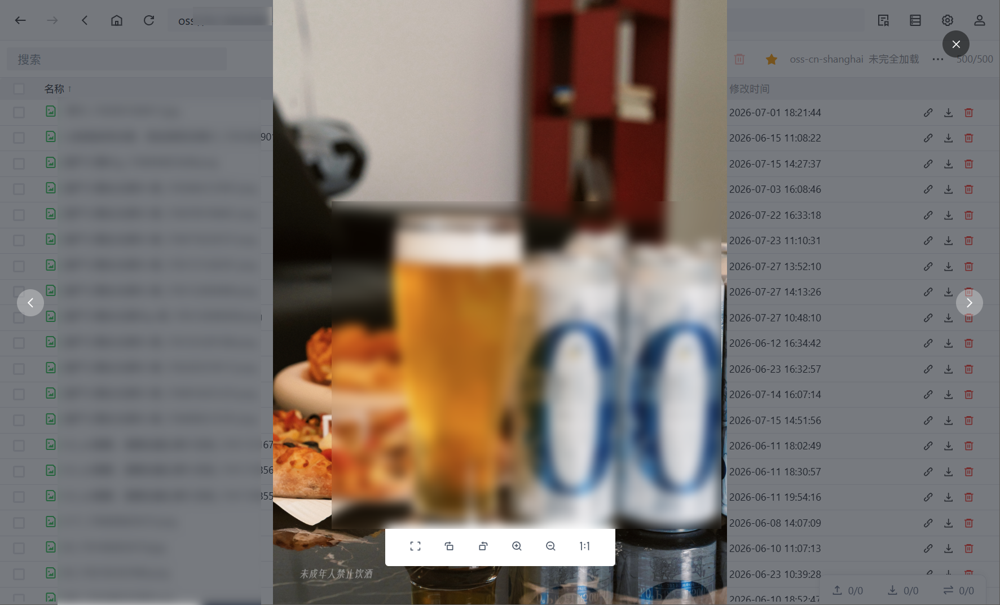

### 视频预览

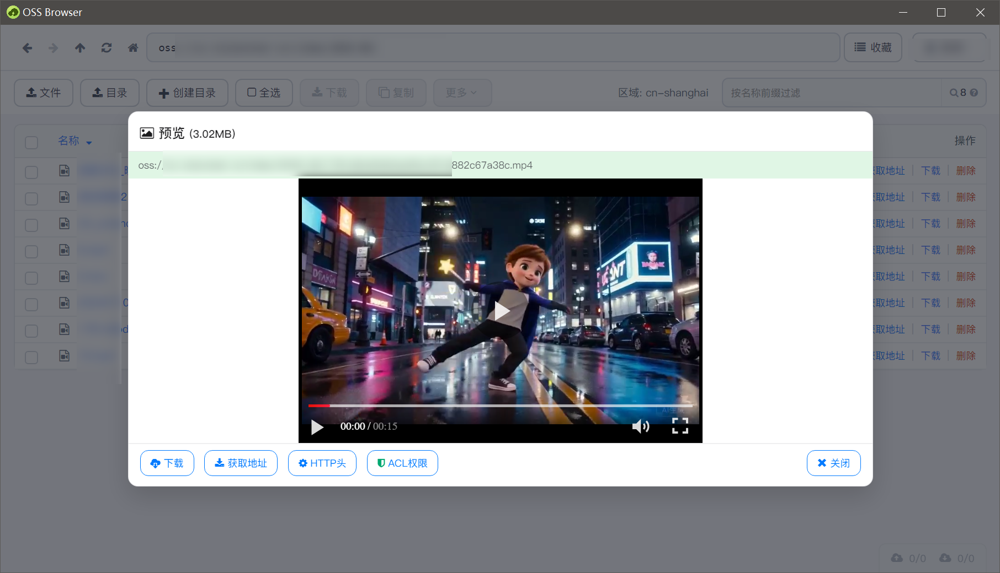

### 音频预览（频谱）

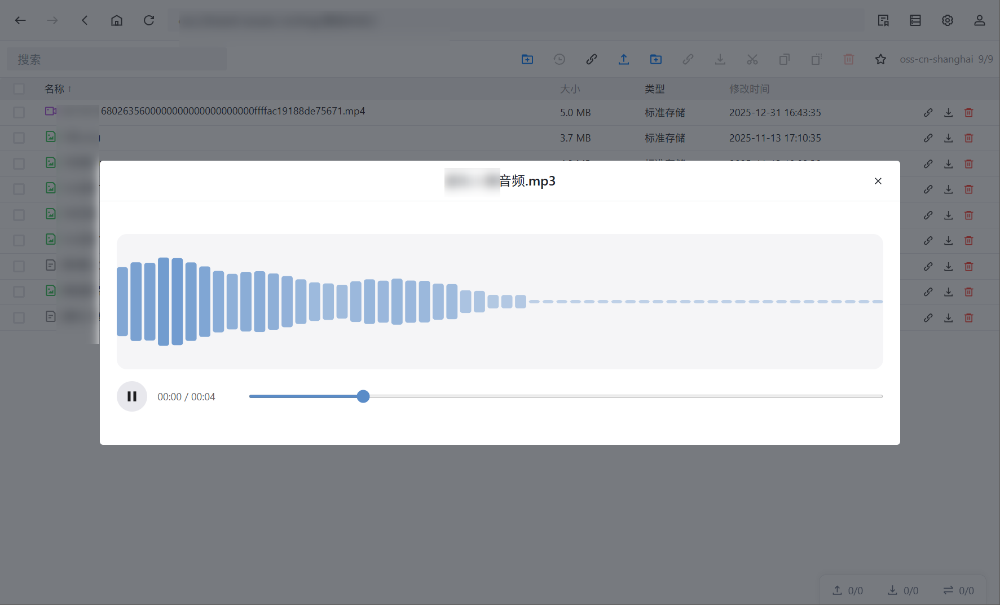

## 功能说明（3.x）

### 1. 登录与账号

| 能力 | 说明 |
| --- | --- |
| AccessKey 登录 | 填写 AccessKeyId / AccessKeySecret，可选备注（便于区分多组 Key） |
| Auth Token 登录 | 粘贴 Base64 令牌；展示 AccessKeyId、OSS 路径、权限、过期时间；过期不可登录 |
| 记住秘钥 | 下次打开回填表单，并写入 AK 历史；**不会**因此自动登录 |
| 保持登录 | 下次启动静默恢复会话（安全存储）；与「记住秘钥」相互独立 |
| AK 历史 | 查看 / 选用 / 改备注 / 删除 / 清空；支持多账号切换 |
| STS / 受限路径 | 支持带 `stoken` 的 STS；可按授权 `osspath` 进入指定前缀 |
| 只读权限 | `readOnly` 时隐藏或禁用写入类操作 |
| 传输服务 | 桌面版启动时自动拉起内置 sidecar；异常时在登录页提示 |

### 2. 浏览与导航

- **列表**：Bucket（名称、区域、创建时间）；对象（名称、大小、存储类型、修改时间）；文件夹优先；支持列排序与当前目录搜索。
- **地址栏**：`oss://bucket/prefix/` 形式跳转；快捷键聚焦地址栏（如 `Ctrl+L` / `Alt+D` / `F6`）。
- **导航**：后退 / 前进 / 上级 / 首页 / 刷新；浏览历史栈；同账号可恢复上次路径。
- **选择与菜单**：多选、右键菜单（空白处 / Bucket / 对象 / 文件夹）。
- **分页**：列举截断时提示「未完全加载」，可继续「加载更多」。
- **收藏夹**：收藏当前目录或指定文件夹；按 AccessKey 隔离存储；列表跳转与移除。

### 3. 上传、下载与传输坞

**上传 / 下载**

- 上传文件、上传文件夹；桌面端支持拖入当前 Bucket/目录。
- 下载所选文件；选中文件夹时递归展开后入队。
- 下载目录模式：**每次询问** 或 **固定目录**（可在设置中配置）。
- **支持将对象拖拽到桌面 / 资源管理器**：在列表中拖出文件或文件夹到本机桌面或其他目录即可触发下载（桌面端；异常时回退到默认下载位置）。
- 同名覆盖策略可配置：开启则覆盖；关闭时若云端同名且大小相同可跳过。

**传输坞**

- 三个页签：**上传** / **下载** / **移动·复制**。
- 显示进度、速度、状态、错误信息；支持状态筛选与关键词搜索。
- 批量：启动全部、暂停全部、清空已完成、清空全部；单任务可暂停 / 继续 / 移除。
- 面板高度可拖拽调整并本地记忆。
- 关闭主窗口时若选择托盘，传输可继续在后台进行。

### 4. 获取地址与二维码

**单个对象**

- 公开读：直链；私有：签名 URL，可设置有效期（秒）并重新生成。
- 域名：系统默认、自定义域名、传输加速（若已开通）。
- 复制地址、浏览器打开、复制加速链接。
- 二维码：展示、复制图片、下载 PNG。

**批量**

- 支持多选文件与文件夹；目录自动展开为文件列表。
- 复制全部地址，或复制「路径 + 地址」。
- 数量超上限时截断并提示。

### 5. 预览

| 类型 | 能力 |
| --- | --- |
| 图片 | 内嵌预览；同目录多图浏览；可选列表缩略图（本机开关） |
| 文本 | txt/md/json/xml/csv/log/html/css/js 等；过大文件提示下载查看 |
| 视频 | 内嵌播放，支持倍速 |
| 音频 | 内嵌播放 + 频谱可视化 + 进度 |
| 其他 | 提示不支持内嵌；可浏览器打开或复制地址 |

### 6. Bucket / 对象操作

**Bucket**

- 新建（名称、Region、ACL、存储类型）、删除（确认）、ACL 查看/修改。

**对象 / 文件夹**

- 新建文件夹、重命名、删除（确认）。
- 剪切（移动）/ 复制 → 切换目录后粘贴；任务进入「移动·复制」队列，可继续其它操作。
- 对象 ACL（继承 Bucket / 私有 / 公共读 / 公共读写）。
- HTTP 头与用户元数据编辑。
- 归档对象解冻（可读天数可配）。
- 创建软链接。
- 未完成分片上传：列出、刷新、中止删除。

### 7. 设置与窗口

设置弹窗分三个页签，宽度自适应（最小约 500px）。

**应用**

- 主窗口关闭策略：最小化到托盘 / 退出应用 / 每次询问（说明见感叹号悬停提示）。
- 默认下载目录：每次询问 / 固定目录。
- 显示图片缩略图（仅本机）。

**其他**

- 最大上传/下载任务数、分片大小、并发分片下载、重试次数、列举 Object 上限。
- 覆盖同名文件。
- 网络代理（HTTP / HTTPS / SOCKS5，仅作用于 OSS，不跟随系统代理）、超时、私有云允许不安全 TLS。

**关于**

- 产品名与图标、本地版本、线上版本（读取 GitHub Latest Release）。
- 点击更新相关操作打开 [GitHub Releases](https://github.com/HyhBlazing/hyh-aliyun-oss-browser/releases)。

**窗口与托盘**

- 最小窗口约 1024×640；位置 / 尺寸 / 最大化跨启动记忆。
- 系统托盘：显示主窗口、退出应用。

## 架构

| 部分 | 技术 | 职责 |
| --- | --- | --- |
| 桌面壳 | Tauri 2 | 窗口、托盘、文件对话框、安全会话、拉起 sidecar |
| 界面 | Vue 3 + Vite + Arco Design | 登录、浏览、传输坞、设置、预览 |
| 传输服务 | Fastify + `ali-oss`（打包为独立二进制） | 登录校验、列举、CRUD、分片传输与进度 |

用户安装包通过 Tauri `externalBin` 分发 sidecar，因此**运行期不依赖本机 Node.js**。开发调试仍需本机 Node / Rust 环境。

## 开发

### 环境

- Node.js 20+
- Rust stable（[rustup](https://rustup.rs/)）
- Windows：WebView2、MSVC Build Tools
- macOS：Xcode Command Line Tools（本机打包时）

### 启动

```bash
# 完整桌面开发（会自动拉起 sidecar）
npm --prefix apps/transfer-sidecar install
npm --prefix apps/desktop install
npm run desktop:dev

# 可选：仅浏览器调试 UI（无原生拖拽/部分对话框能力）
npm run desktop:ui

# 可选：单独启动 sidecar
npm run sidecar
```

默认 sidecar：`http://127.0.0.1:17823`，开发 token：`dev-token`。

### 打包

```bash
npm run desktop:build
```

- 产物目录：`apps/desktop/src-tauri/target/release/bundle/`
- 打包前执行 `scripts/pack-sidecar.cjs`，生成平台对应的 sidecar 可执行文件
- CI：[`.github/workflows/build-desktop-v3.yml`](.github/workflows/build-desktop-v3.yml)  
  （Windows / Ubuntu / macOS `aarch64-apple-darwin`）

## 合规与贡献

- 请完整保留 [LICENSE](LICENSE)、[NOTICE](NOTICE) 及上游版权声明
- 向官方上游贡献请前往 [aliyun/oss-browser](https://github.com/aliyun/oss-browser)
- 欢迎对本仓库提 Issue / PR；请勿提交真实 AccessKey 或密钥材料
- 截图与文档中的路径、区域信息请使用脱敏示例，避免泄露生产环境数据

## License

[Apache License 2.0](LICENSE)

Copyright 2016 Aliyun.com（上游原作）  
Copyright 2026 何昀桦 / HyhBlazing（本仓库修改与 3.x 重写部分）
